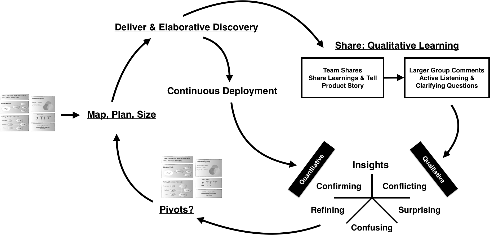

Describe the workflow... probably want to number these.

## What's a play? 

A play is an optional piece of workflow, an artifact, a way of facilitating an event, or other pattern that you can bring into your dojo challenge design and execution.

This chapter is broken into a few sections:

- Challenge Plays: these are the essential components of a dojo team challenge.
- Program Plays: these are areas of consideration if you're launching a dojo program within a larger organization.
- Leadership Plays: these are ways in which leaders can interact to help increase the efficacy and success of individual challenge teams.